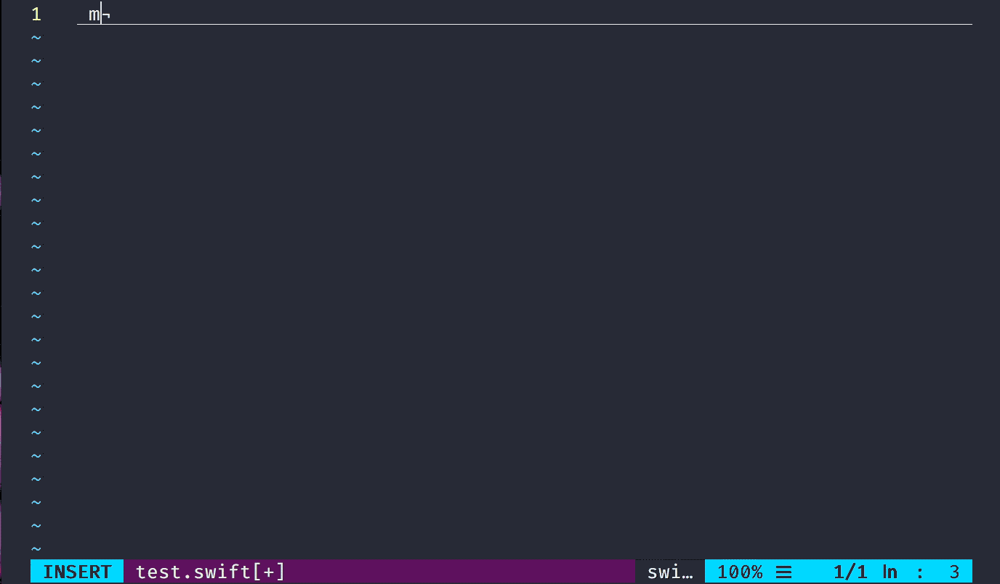

# TeaCode Vim Helper

Provides integration with TeaCode https://www.apptorium.com/teacode

TeaCode is a powerful app, created to write code super fast by expanding short, dynamic code templates into the real code. It comes with a simple variable-based language that supports subexpressions, optional patterns and filters. Creating new expanders is extremely easy. TeaCode supports native editors (Xcode, TextMate, Coda, etc.) as well as Atom, Sublime Text, VSC and JetBrains IDEs (PHPStorm, AppCode, etc.)

## How to install

1. Save `expand.sh` to your Home folder.
2. Add the contents of `teacode.vim` to your `.vimrc`.

## How to use it

1. Install TeaCode from https://www.apptorium.com/teacode.
2. Open TeaCode
3. Write an expression (for example `-f helloWorld`) and press ctrl+alt+e (notice that shortcut is different than the shortcut for native macOS apps)
